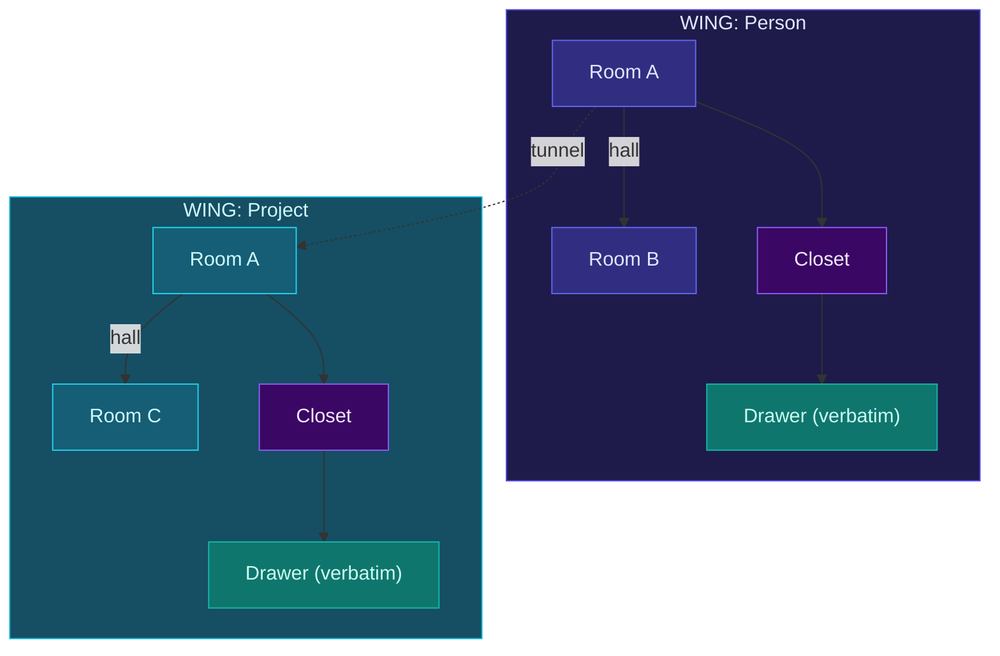

# The Palace

Ancient Greek orators memorized entire speeches by placing ideas in rooms of an imaginary building. Walk through the building, find the idea. MemPalace applies the same principle to AI memory.

## Structure

Your conversations are organized into a navigable hierarchy:



## Components

### Wings

A person or project. As many as you need.

Every project, person, or topic gets its own wing in the palace. Wings are the top-level organizational unit.

### Rooms

Specific topics within a wing. Examples: `auth-migration`, `graphql-switch`, `ci-pipeline`.

Rooms are named ideas. They're auto-detected from your folder structure during `mempalace init`, and you can create additional rooms manually.

### Halls

Halls are the conceptual categories that describe how related memories connect *within* a wing:

- `hall_facts` — decisions made, choices locked in
- `hall_events` — sessions, milestones, debugging
- `hall_discoveries` — breakthroughs, new insights
- `hall_preferences` — habits, likes, opinions
- `hall_advice` — recommendations and solutions

### Tunnels

Connections *between* wings. When the same room appears in different wings, the graph layer can treat that as a cross-wing connection.

```
wing_kai       / hall_events / auth-migration  → "Kai debugged the OAuth token refresh"
wing_driftwood / hall_facts  / auth-migration  → "team decided to migrate auth to Clerk"
wing_priya     / hall_advice / auth-migration  → "Priya approved Clerk over Auth0"
```

Same room. Three wings. The graph can use that shared room name as a bridge.

### Closets

Closets are the summary layer in the broader MemPalace vocabulary: compact notes that point back to the original content. In the current implementation, the main persisted storage path is still the underlying drawer text plus metadata.

### Drawers

The original stored text chunks. This is the primary retrieval layer used by the current search and benchmark flows.

## Why Structure Matters

Tested on 22,000+ real conversation memories:

| Search scope | R@10 | Improvement |
|-------------|------|-------------|
| All closets | 60.9% | baseline |
| Within wing | 73.1% | +12% |
| Wing + hall | 84.8% | +24% |
| Wing + room | 94.8% | +34% |

The practical point is that structure improves retrieval. In the project benchmarks, narrowing the search scope by wing and room outperformed searching the entire corpus at once.

## Navigation

The palace supports graph traversal across wings:

```text
MCP tool: mempalace_traverse
  arguments: { "start_room": "auth-migration" }
  → discovers rooms in wing_kai, wing_driftwood, wing_priya

MCP tool: mempalace_find_tunnels
  arguments: { "wing_a": "wing_code", "wing_b": "wing_team" }
  → auth-migration, deploy-process, ci-pipeline
```

This is the navigation story: shared room structure gives the model more than one way to reach relevant context.
